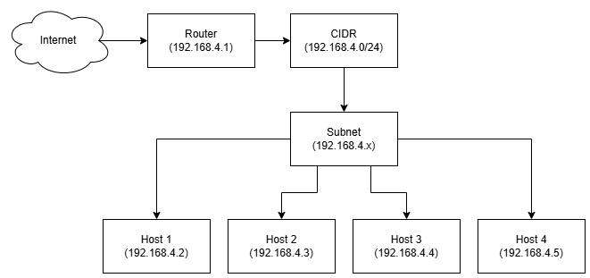

# Day 2 - Basic Shell and Computer Network

### **Q1 :**

Buat sebuah diagram sebuah jaringan komputer dengan 4 device dengan kondisi :

- IP Class C : 192.168.4.xxx

- CIDR Block : 192.168.4.0/24

### **A1 :**

---

---

### **Q2 :**

Jelaskan perbedaan antara SH (Shell) dan BASH (Bourne-Again Shell)

### **A2 :**

**SH (Shell)** adalah sintaks atau bahasa paling mendasar yang digunakan pada sistem UNIX. Karena kesederhanaannya, SH kompatibel di seluruh sistem UNIX walaupun minim fitur.

Di sisi lain, **Bash (Bourne-Again Shell)** bisa dibilang merupakan modifikasi dari **Shell** yang memiliki banyak fitur tambahan. Misalnya seperti _autocomplete_, _history_, beberapa algoritma pemrograman, dan sebagainya. Hanya saja, tidak seperti **Shell** yang bisa langsung dipakai _out-of-the-box_, **Bash** harus diinstall terlebih dahulu jika ingin dipakai. Walaupun demikian, umumnya semua distro Linux sudah secara default menyertakan **Bash** di dalamnya.

---

---

### **Q3 :**

Buat dokumentasi/kumpulan command linux yang kalian ketahui! (Command diluar materi akan diberi nilai ++)

### **A3 :**

**echo**

- ( echo text ) akan menampilkan ( text )
- ( echo "text" > text.txt ) akan membuat file "text.txt" dengan isi "text"

**pwd**

- singkatan dari "Print Working Directory"
- ( pwd ) akan menampilkan alamat direktori saat ini

**cd**

- singkatan dari "Change Directory"
- ( cd folder ) akan maju ke dir "folder" jika tersedia
- ( cd .. ) akan mundur ke dir sebelumnya
- ( cd / ) akan pindah ke root dir
- ( cd /home/user2 ) akan pindah ke "/home/user2"
