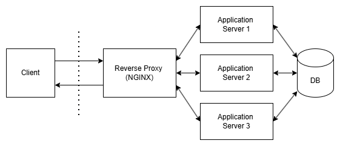

# Day 5 - Application in Server

### **Q1 :**

Gambarkan sturktur web server menggunakan reverse proxy dan jelaskan cara kerjanya!

### **A1 :**

Request dari Client akan ditangkap NGINX terlebih dahulu sebelum memasuki server aplikasi. Dengan fitur **Reverse Proxy** yang dimiliki NGINX, client tidak akan mengetahui server mana yang menangkap responsenya.

---

### **Q2 :**

Buatlah Reverse Proxy untuk aplilkasi yang sudah kalian deploy kemarin. (wayshub), untuk domain nya sesuaikan nama masing".

### **A2 :**

